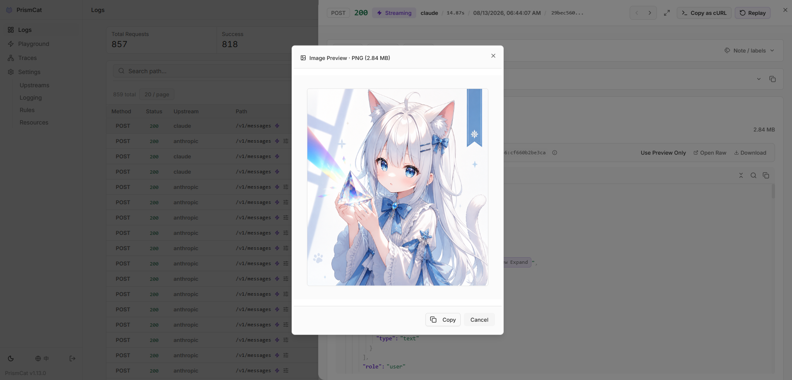

# 🐱 PrismCat

[English](./README.md) | [简体中文](./README_CN.md)

  

> **You never know how much junk your SDK silently injects into your prompts — until you use PrismCat.**

PrismCat is a **self-hosted, transparent proxy and debugging console for LLM APIs**.
Change one line — your `base_url` — and instantly see every request and response between your app and OpenAI / Claude / Gemini / Ollama / any LLM API, including streaming (SSE).

<!-- 📸 PrismCat Dashboard -->


---

## ⚡ Get Started in 30 Seconds

### 1. Launch

Grab the binary for your system from [Releases](https://github.com/paopaoandlingyia/PrismCat/releases).

| Platform | How to Start |
|----------|-------------|
| **Windows** | Run `prismcat.exe` — it lives in your system tray |
| **Linux / macOS** | Run `./prismcat` |
| **Docker** | See [Docker Deployment](#-docker-deployment) |

Open **`http://localhost:8080`** in your browser.

### 2. Add an Upstream

In the Settings page, add an upstream. For example:

| Name | Target |
|------|--------|
| `openai` | `https://api.openai.com` |

PrismCat gives you a proxy address: **`http://openai.localhost:8080`**

### 3. Change One Line, Start Capturing

```python
from openai import OpenAI

client = OpenAI(
    base_url="http://openai.localhost:8080/v1",  # ← change only this
    api_key="sk-..."
)

# everything else stays exactly the same
response = client.chat.completions.create(
    model="gpt-4o",
    messages=[{"role": "user", "content": "Hello!"}],
)
```

Go back to the dashboard. Your full request and response are already there. That's it.

---

## 🧩 How It Works

PrismCat uses **subdomain routing** for truly transparent proxying. When you add an upstream named `openai`:

```
Your App                     PrismCat                      OpenAI
   │                           │                             │
   │  openai.localhost:8080    │   api.openai.com            │
   │ ─────────────────────────>│ ────────────────────────────>│
   │                           │       logs request ✓         │
   │<─────────────────────────│<────────────────────────────│
   │                           │       logs response ✓        │
```

**Why subdomains?** Because they make the proxy truly transparent — your request paths (like `/v1/chat/completions`) stay exactly the same. No path rewriting, no SDK quirks. Any language, any SDK, any LLM — as long as it lets you set a `base_url`, it just works. You can even chain proxies (App → PrismCat → relay → OpenAI) with zero friction.

> **💡 About `*.localhost`**: Modern browsers and most operating systems automatically resolve `*.localhost` to `127.0.0.1` — no hosts file editing required. If your environment doesn't support this, see [Path Routing Mode](#-fallback-path-routing-mode) or add a hosts entry manually.

---

## ✨ Key Features

### 📊 Full Traffic Observability
- Complete request/response headers and bodies with keyword search and highlighting
- **SSE streaming** captured in full — view raw chunks or the merged result
- Auto-formatted JSON, smart Base64 folding (no more drowning in image data) with one-click image preview
- Copy any request as a ready-to-run **cURL command**




### 🎮 One-Click Replay (Playground)
See a failed request? Hit **Replay**, tweak the prompt or parameters right in your browser, and resend instantly. No need to re-run your Python/Node script.

### 📈 Trace & Usage Tracking
Automatically correlate related requests into traces, and extract token usage from responses. Built-in extraction rules for OpenAI, Anthropic, and Gemini — or define your own.

### 🔀 Target Presets
Keep multiple complete target presets behind one stable proxy endpoint and switch between them manually from Settings. Each preset keeps its target URL, timeouts, outbound proxy, request-override bindings, and Usage bindings together, preventing mismatches such as a new URL being used with an old key.

Beyond LLM providers, this is useful for production/staging, direct/proxied routes, regional endpoints, tenant credentials, and switching between a live service and a mock/replay server. The client URL stays unchanged; a switch affects new requests only, while in-flight streams continue with the snapshot they started with.

### 🛠️ Request Override (Opt-In)
Rewrite outbound requests without touching your code — set, remove, or conditionally default JSON body fields, append/prepend to arrays, and set or strip HTTP headers. Each rule is matched by method / path / JSON content; the log detail page shows a side-by-side diff of the original vs. final request.

> **🔒 Strictly opt-in.** PrismCat is a transparent proxy by default and **never** touches your requests unless you (1) flip the master switch, (2) define rules, and (3) bind them to specific upstreams. Skip any of those steps and every byte is forwarded untouched.

### 🔐 Privacy & Security
- **Fully local** — data stays in local SQLite + filesystem, no third-party servers
- Automatic masking of sensitive headers (`Authorization`, `api-key`)

### 🏷️ Log Tagging
Add `X-PrismCat-Tag: my-tag` to any request header to categorize logs in the UI. Perfect for shared proxies with multiple users or projects.

### 📦 Dead-Simple Deployment
Single binary, zero dependencies. Windows system tray support. Native Docker image available.

### 🔄 Always-On, Always Reviewable
PrismCat is designed to run as a **silent, 24/7 LLM black box**. You don't need to "remember to start capturing" when a bug happens — it's already recording. Automatic log retention cleanup and large-body offloading keep storage healthy over months of continuous operation. Perfect for monitoring autonomous Agents that you can't fully predict — just go back and review what they actually sent and received, days after the fact.

---

## 🎯 Who Needs PrismCat?

| Your Problem | How PrismCat Helps |
|-------------|-------------------|
| "Why is my token usage so high? My prompt is short!" | See the hidden system prompts and few-shot examples your SDK/framework silently injects |
| "Function Calling keeps returning broken JSON" | Capture the raw model output, tweak your prompt in the Playground, and retry instantly |
| "Streaming output sometimes freezes or gets truncated" | Every SSE chunk is recorded — pinpoint whether the issue is the model, gateway, or client |
| "I run local models with Ollama, want to inspect the traffic" | Add an upstream pointing to `http://localhost:11434` — it's a universal HTTP proxy |
| "Multiple people share one API key — whose request failed?" | Use `X-PrismCat-Tag` to tag by user, find the culprit in seconds |
| "My Agent went rogue and I have no idea what it did" | PrismCat silently logs every API call — review the full behavior chain anytime |
| "How many tokens is each upstream actually using?" | Built-in **Usage Tracking** extracts token counts from OpenAI / Claude / Gemini responses automatically |
| "I want to cap `max_tokens` globally / strip a field LangChain auto-injects" | Write a rule in **Request Override** to set, remove, or default any JSON field (opt-in; transparent by default) |
| "I need to switch routes/credentials without changing the client URL" | Create multiple **Target Presets** under one upstream and switch URL, proxy, and rule bindings as one unit |

---

## 🤔 PrismCat vs. Alternatives

| | PrismCat | mitmproxy | Langfuse / Helicone |
|---|---------|-----------|---------------------|
| Deployment | Single binary / Docker | Local install + certs | SaaS or complex self-host |
| LLM-Optimized | ✅ JSON formatting, Base64 folding, SSE merge | ❌ Generic HTTP inspector | ✅ But geared toward production monitoring |
| One-Click Replay | ✅ Built-in Playground | ❌ | Partial |
| Integration | Change `base_url` | System-wide proxy / certs | Instrument SDK code |
| Data Ownership | Fully local | Fully local | Third-party dependent |
| Stream Playback | ✅ Raw + merged view | Poor UX | Partial |
| Long-Term Running | ✅ Auto-cleanup, silent background | Ad-hoc debugging tool | ✅ But requires external infra |

---

## 🐳 Docker Deployment

### Docker Compose

Create a `docker-compose.yml`:

```yaml
services:
  prismcat:
    image: ghcr.io/paopaoandlingyia/prismcat:latest
    container_name: prismcat
    ports:
      - "8080:8080"
    environment:
      # Dashboard hosts. Use localhost locally; use your domain or IP on a server.
      - PRISMCAT_UI_HOSTS=localhost,127.0.0.1
      # Base domain for subdomain routing. For bare-IP deployments, enable path routing instead.
      - PRISMCAT_PROXY_DOMAINS=localhost
      # For bare IP / no wildcard domain deployments: set PRISMCAT_UI_HOSTS to your IP and enable path routing.
      # - PRISMCAT_UI_HOSTS=YOUR_IP
      # - PRISMCAT_ENABLE_PATH_ROUTING=true
      # Recommended for public-facing deployments; leave empty to set it on first UI access
      - PRISMCAT_UI_PASSWORD=your_strong_password
      - PRISMCAT_RETENTION_DAYS=30
    volumes:
      - ./data:/app/data
    restart: always
```

```bash
docker compose up -d
```

### Docker Run

```bash
docker run -d --name prismcat \
  -p 8080:8080 \
  -e PRISMCAT_UI_HOSTS=localhost,127.0.0.1 \
  -e PRISMCAT_PROXY_DOMAINS=localhost \
  -e PRISMCAT_UI_PASSWORD=your_strong_password \
  -e PRISMCAT_RETENTION_DAYS=30 \
  -v ./data:/app/data \
  --restart always \
  ghcr.io/paopaoandlingyia/prismcat:latest
```

---

## 🔀 Fallback: Path Routing Mode

If your environment can't resolve `*.localhost`, or you're deploying to a bare IP without a wildcard domain, enable **path routing mode** in Settings to route by URL path instead of subdomain:

```python
# Path routing mode — no subdomain resolution needed
client = OpenAI(
    base_url="http://localhost:8080/_proxy/openai/v1",  # On a server: http://YOUR_IP:8080/_proxy/openai/v1
    api_key="sk-..."
)
```

Enable via config or environment variable:

```yaml
# config.yaml
server:
  enable_path_routing: true
  path_routing_prefix: "/_proxy"
```

```bash
# or via environment variable
PRISMCAT_ENABLE_PATH_ROUTING=true
```

> **Note**: Path routing adds a prefix to your request URL (e.g., `/_proxy/openai/...`), which may require extra care with how some SDKs construct paths. Subdomain mode doesn't have this caveat.

---

## 🌐 Production Deployment (Nginx + Wildcard Domain)

For public-facing deployments, use a wildcard domain (e.g., `*.prismcat.example.com`) with Nginx:

```nginx
server {
    listen 80;
    server_name prismcat.example.com *.prismcat.example.com;

    location / {
        proxy_pass http://127.0.0.1:8080;
        proxy_set_header Host $host;  # Required: pass original Host for subdomain routing

        # Required for SSE / streaming
        proxy_http_version 1.1;
        proxy_set_header Connection "";
        proxy_buffering off;

        client_max_body_size 50M;
    }
}
```

Then add `prismcat.example.com` to PrismCat's `proxy_domains`. The dashboard is available at `prismcat.example.com`, and your upstream `openai` is available at `openai.prismcat.example.com`.

---

## ⚙️ Configuration Reference

The config file lives at `data/config.yaml` and is created on first launch. Most settings can also be changed from the Settings page in the UI.

<details>
<summary>Full config example</summary>

```yaml
server:
  port: 8080
  ui_password: ""           # Console password; leave empty to set it on first UI access
  proxy_domains:            # Base domains for subdomain routing
    - localhost

logging:
  max_request_body: 5242880       # Save request content up to 5MB
  max_response_body: 33554432     # Save response content up to 32MB
  sensitive_headers:              # Headers to auto-mask
    - Authorization
    - api-key
    - x-api-key
  detach_body_over_bytes: 2097152 # Load bodies > 2MB on demand
  body_preview_bytes: 524288      # Inline readable preview; lower for high-frequency long-running use
  early_request_body_snapshot: false

storage:
  retention_days: 30              # Log retention in days; 0 = keep forever

upstreams:
  openai:
    target: "https://api.openai.com"
    timeout: 120 # Total timeout for the entire upstream request and response
    response_header_timeout: 60 # Advanced: wait for HTTP status/headers; 0 disables; always bounded by total timeout
    response_body_first_byte_timeout: 30 # Advanced: wait for the first response body byte after headers; applies to all responses
    response_body_idle_timeout: 15 # Advanced: maximum silence after the body starts; resets whenever data arrives
    outbound_proxy: "env"          # env, direct, or a proxy URL such as http://127.0.0.1:7890
  gemini:
    target: "https://generativelanguage.googleapis.com"
    timeout: 120
    response_header_timeout: 0
    response_body_first_byte_timeout: 0
    response_body_idle_timeout: 0 # 0 disables the corresponding stage timeout
    outbound_proxy: "http://127.0.0.1:7890"
  # Optional: multiple complete target presets behind one stable endpoint.
  # target and targets are mutually exclusive; the legacy single-target form remains supported.
  codex:
    active_target: primary
    targets:
      primary:
        url: "https://api.openai.com"
        timeout: 120
        outbound_proxy: "env"
        request_overrides:
          enabled: false
          rule_names: []
      backup:
        url: "https://api.example.com"
        timeout: 120
        outbound_proxy: "direct"
        request_overrides:
          enabled: false
          rule_names: []

# Request override (opt-in, off by default)
# Supports ops: set, remove, default, append, prepend for JSON body; set, remove for headers.
request_overrides:
  enabled: false
  max_body_bytes: 1048576
  upstreams: {}
  rules: []

# Token usage extraction (off by default)
# Built-in rules for OpenAI, Anthropic, Gemini; define your own via paths.
usage_extraction:
  enabled: false
  upstreams: {}
  rules: []   # see config.example.yaml for built-in rule definitions
```

</details>

---

## 🧩 FAQ

<details>
<summary><b>Q: <code>openai.localhost</code> doesn't work?</b></summary>

Most modern systems resolve `*.localhost` to `127.0.0.1` automatically. If yours doesn't:
1. Add `127.0.0.1 openai.localhost` to your hosts file
2. Or enable [Path Routing Mode](#-fallback-path-routing-mode) as a workaround
3. Or use your own wildcard domain (see [Nginx Deployment](#-production-deployment-nginx--wildcard-domain))
</details>

<details>
<summary><b>Q: Streaming feels "stuck"?</b></summary>

If you're behind a reverse proxy (e.g., Nginx), make sure you have:
- `proxy_buffering off;`
- `proxy_http_version 1.1;`

Nginx buffers entire responses by default, making streaming look like it's hanging.
</details>

<details>
<summary><b>Q: Which LLM services are supported?</b></summary>

PrismCat is a generic HTTP proxy — it's not tied to any specific LLM provider. Any HTTP/HTTPS API works, including:
- OpenAI / Azure OpenAI
- Anthropic Claude
- Google Gemini
- Ollama / LM Studio (local models)
- API relay services / aggregators
</details>

<details>
<summary><b>Q: Does it add latency?</b></summary>

PrismCat uses asynchronous log writing. The proxy overhead is typically under 1ms. Logging never blocks request forwarding.
</details>

---

## ❤️ Support PrismCat

If PrismCat helps you debug LLM apps or saves you time, you can support the project here:

[Support PrismCat on Afdian](https://afdian.com/a/etgpao)

---

## 🛡️ License

[MIT License](LICENSE)
